# io7 Platform — the lessons

This is the second half of the [io7 user guide](user-guide.md). It assumes you have a platform
running and have watched a dummy device report to it — [Steps 1 to 3](user-guide.md).

From here you build something with it. Step 4 needs no hardware; Steps 5 and 6 are about
putting real boards under what you built, and Steps 7 and 8 are optional directions to take it.

| Step | What you do | Hardware needed |
|---|---|---|
| [4](#4--build-the-automation-in-node-red) | Write your automation: lamp → switch → light sensor → gate → dashboard | none |
| [5](#5--swap-in-real-devices-micropython) | Put real MicroPython devices under it | 2 × ESP32, relay, button |
| [6](#6--swap-in-real-devices-arduino-c) | Or Arduino C++ devices instead | same boards |
| [7](#7--move-the-rule-to-an-edge-server) | Move a rule to a Raspberry Pi so it survives an outage | + Raspberry Pi |
| [8](#8--rebuild-it-in-python-with-io7app) | Write the same automation in Python, then vibe-code a web page | none |

---

## 4 · Build the automation in Node-RED

This is the heart of the guide. You build one flow in four passes, each pass adding a
capability. Open Node-RED at `http://<your-host>:1880`.

First, get an App ID: Management Web → App Id List → add `app1` and note its token. Node-RED
uses this to talk to the broker.

### Set up the io7 nodes

**The io7 nodes are already there.** You did not install them by hand because the platform
installer did it for you — `io7-platform-setup.sh` ends by running `npm i` in `~/data/nodered`,
and the `package.json` shipped in that directory lists `node-red-contrib-io7` as a dependency:

```json
"dependencies": {
    "io7-nodered-auth": "github:io7lab/io7-nodered-auth",
    "node-red-contrib-io7": "github:io7lab/node-red-contrib-io7",
    "redis": "^4.6.13"
}
```

Since `~/data/nodered` is mounted into the Node-RED container, the nodes appear in the palette
the moment the container starts.

You get three of them. **io7 in** subscribes to a device's events, **io7 out** publishes a
command, and **io7-hub** holds the connection settings both share. Pick a device ID and an
event name; the nodes assemble the topic and parse the JSON for you.

You could do the same with the generic `mqtt in` / `mqtt out` nodes, but then you type
`iot3/lux1/evt/status/fmt/json` by hand in every flow — and a single wrong character produces
no error at all, just silence. That failure mode costs more debugging time than anything else
in this guide.

> **Running Node-RED on your own?** A plain Node-RED install has none of this. Add the nodes
> from Manage palette → Install by searching `node-red-contrib-io7`, and set the io7-hub
> **Host** to your platform's hostname instead of `mqtt` — your Node-RED is outside the
> platform's Docker network, so the service name will not resolve.

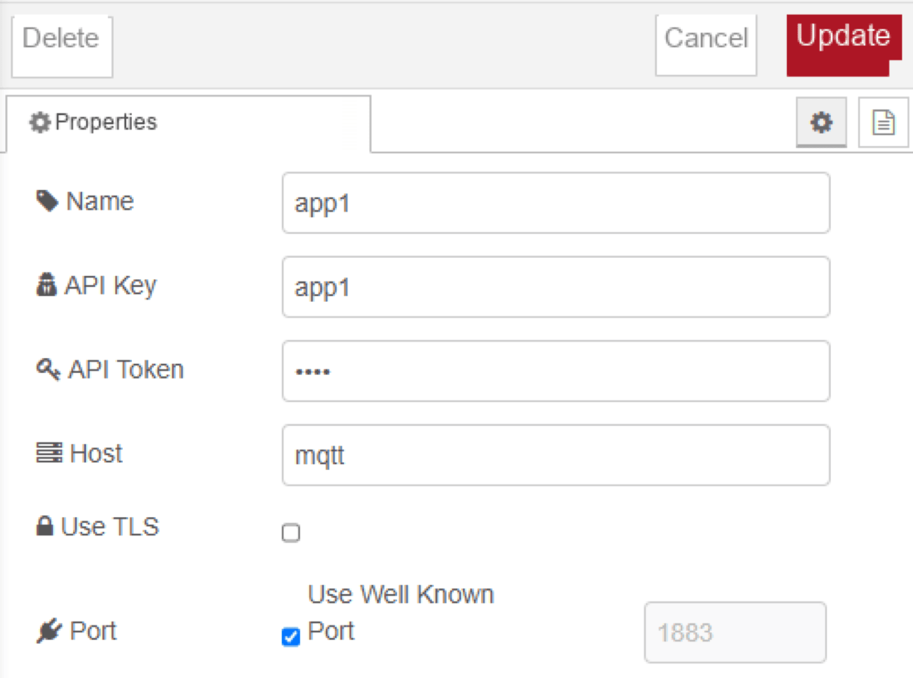

| Field | Value |
|---|---|
| API Key / API Token | `app1` and its token |
| Host | `mqtt` |
| Port | 1883 |

> **Host is `mqtt`, not your domain name.** The bundled Node-RED runs in the same Docker
> network as the broker, so it reaches it by service name. Use your real hostname only when
> you run Node-RED outside the platform.

### Pass 1 — turn the lamp on and off

Register a device `lamp1`, then run a dummy lamp in a new terminal:

```bash
npx github:io7lab/io7dummy-device lamp
```

Build this: **inject** (`on`) and **inject** (`off`) → **change** → **io7 out**.

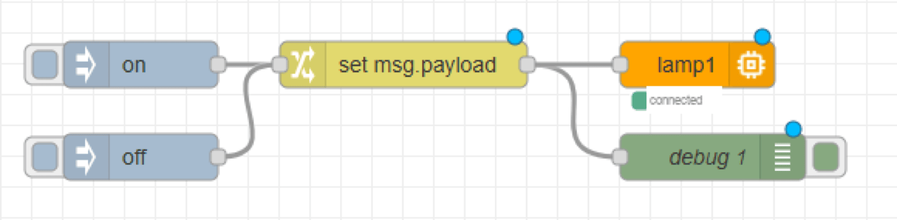

The change node wraps the plain string into an io7 command. Set the rule to
`Set msg.payload`, switch the value type to **expression (JSONata)**, and enter:

```text
{"d":{"lamp": msg.payload }}
```

Configure io7 out with Device Id `lamp1`, command `power`, format `json`.

Deploy. `connected` should appear under the node. Click the inject buttons — the ASCII lamp
in the terminal turns on and off.

### Pass 2 — let a switch do it

Now a *device* drives the lamp instead of you. Register `button1` and run:

```bash
npx github:io7lab/io7dummy-device button
```

Add **io7 in** (`button1`, event `status`) → **function** named `Push` → the existing io7 out.

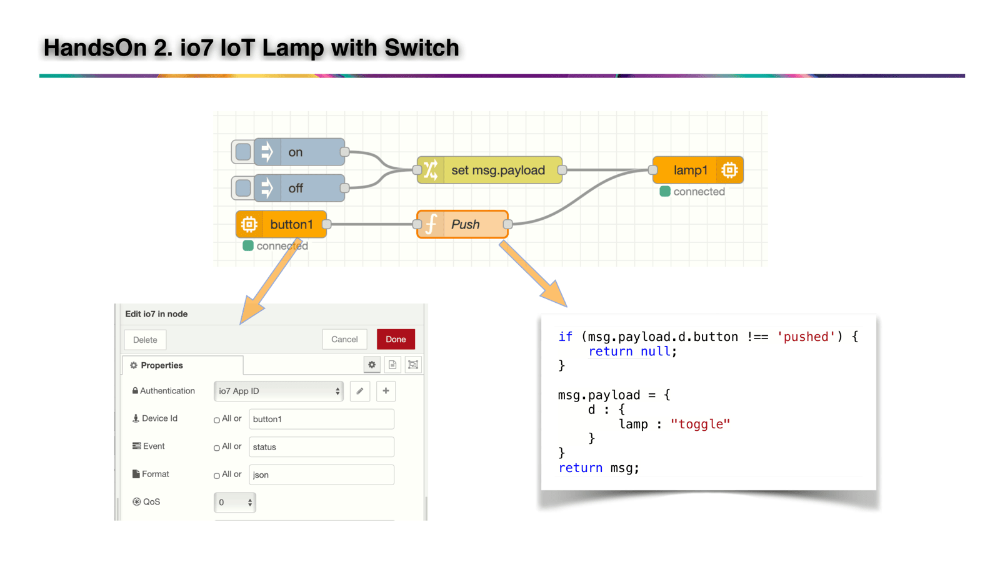

```javascript
if (msg.payload.d.button !== 'pushed') {
    return null;
}
msg.payload = { d: { lamp: 'toggle' } };
return msg;
```

Press the space bar in the button terminal. The lamp toggles.

That is the whole shape of IoT automation: **device event → application decides → device
command.** Everything after this is a variation on it.

### Pass 3 — a dashboard

Install `@flowfuse/node-red-dashboard` (Dashboard 2.0 — not the deprecated
`node-red-dashboard`).

Drop a **ui-switch** widget and build its Group → Page → Dashboard once. Then wire both
directions:

- **control:** ui-switch → function `lamp out` → io7 out(`lamp1`)
- **display:** io7 in(`lamp1`) → function `lamp in` → ui-switch

```javascript
// lamp out
msg.payload = { d: { lamp: msg.payload } };
return msg;
```

```javascript
// lamp in
msg.payload = msg.payload.d.lamp;
return msg;
```

> **Turn off "If msg arrives on input, pass through to output" on the switch widget.**
> Otherwise the display message loops back out as a command, which produces another event,
> which loops again. With pass-through off, the widget shows what the device actually
> reports — no matter who changed it.

Open `http://<your-host>:1880/dashboard`. Flip the widget; the lamp follows. Press space in
the button terminal; the *widget* follows.

### Pass 4 — automate on light, and add a gate

Register `lux1` (you already did in [Step 2](user-guide.md#2--verify-with-a-dummy-device)) and run the lux dummy. Add
**io7 in**(`lux1`) → **function** `Lux` → io7 out(`lamp1`):

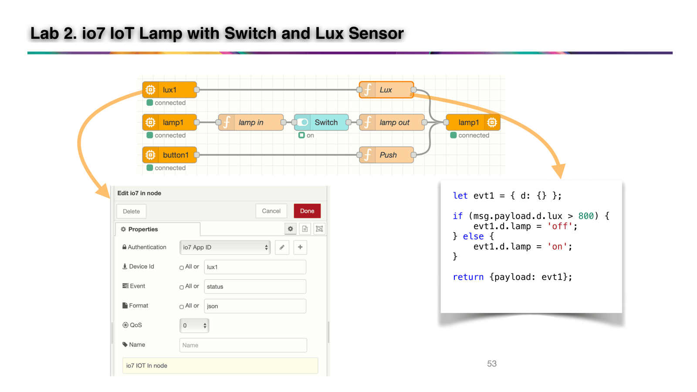

```javascript
let cmd = { d: {} };
cmd.d.lamp = msg.payload.d.lux > 800 ? 'off' : 'on';
msg.payload = cmd;
return msg;
```

Arrow keys in the lux terminal now turn the lamp on and off by themselves.

But automation that cannot be switched off is a nuisance — turn the lamp on manually in
daylight and the next reading kills it. So add a **gate**.

Install `node-red-contrib-simple-gate`. Put the gate between the `Lux` function and io7 out.
Add a second ui-switch labelled `Auto` → function `auto` → the gate.

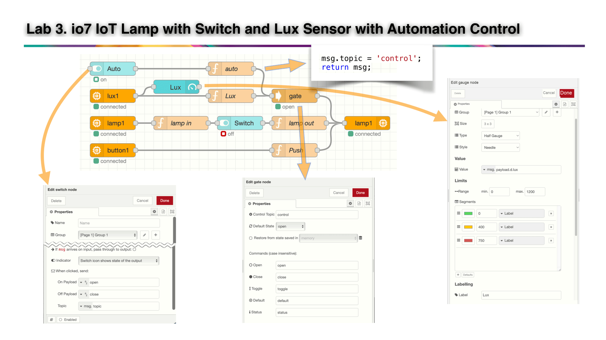

```javascript
// auto
msg.topic = 'control';
return msg;
```

Set the Auto widget's On Payload to the string `open` and Off Payload to `close`; those are
the words the gate understands. Its Control Topic is `control` and Default State is `open`.

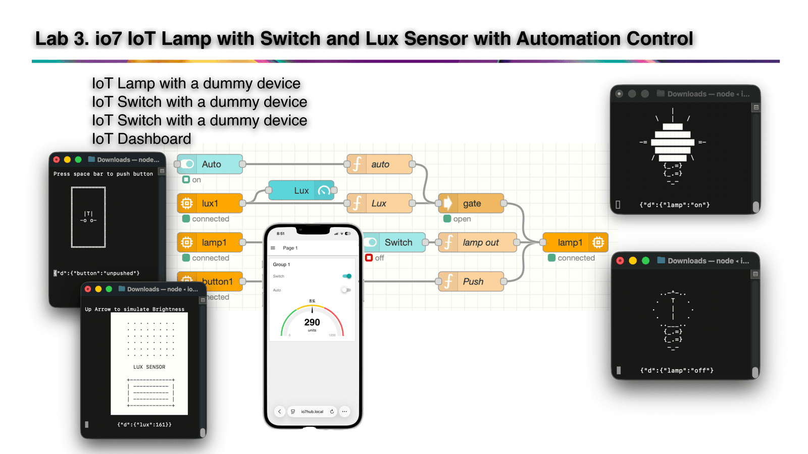

Three things should now be true:

1. With **Auto on**, changing the light changes the lamp.
2. With **Auto off**, the light is ignored.
3. With **Auto off**, the dashboard switch and the button still work — the gate only sits on
   the automation path.

Reference flows: [`3.iot-lamp`](https://github.com/io7lab-lab/3.iot-lamp) ·
[`3.iot-lamp-switch`](https://github.com/io7lab-lab/3.iot-lamp-switch) ·
[`3.iot-lamp-switch-dashboard`](https://github.com/io7lab-lab/3.iot-lamp-switch-dashboard) ·
[`3.iot-lamp-switch-dashboard-lux-auto`](https://github.com/io7lab-lab/3.iot-lamp-switch-dashboard-lux-auto)


### What you just did

Four passes, four capabilities, and every one of them followed the same shape:

**something reports → the application decides → something is commanded.**

That is the whole of IoT automation. The button did not know about the lamp. The light sensor
did not know about either. Each device only ever talked to the broker about itself, and all
the knowing lived in your flow.

Two habits are worth carrying forward. **Show what the device reports, not what you
commanded** — that is why pass-through came off the switch widget, and why the dashboard is
still right when someone presses the physical button. And **put a gate on anything automatic**
— an automation you cannot switch off is one you will end up fighting.

---

## 5 · Swap in real devices (MicroPython)

Now replace the dummy lamp and switch with two ESP32 boards. **Do not change the flow.**
Register the same device IDs, or reuse `lamp1` and `button1` directly.

This is the moment the topic contract pays off. The flow you wrote in Step 4, the dashboard
you opened on your phone, the gate you added — none of it knows or cares what is on the other
end of the broker.

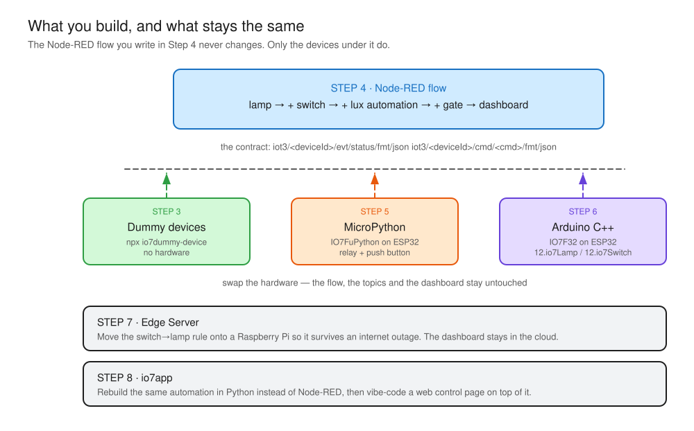

You need: 2 × ESP32, one relay module, one push button, breadboard and jumpers.

### Install the framework

Flash MicroPython, open Thonny, connect Wi-Fi in the REPL, then:

```python
import mip
mip.install('github:io7lab/IO7FuPython/')
```

Two config files go on the board:

```json
// wifi.cfg
{"ssid": "<YOUR_SSID>", "pw": "<YOUR_PASSWORD>"}
```

```json
// device.cfg
{"broker": "my.example.com", "token": "lamp1", "devId": "lamp1"}
```

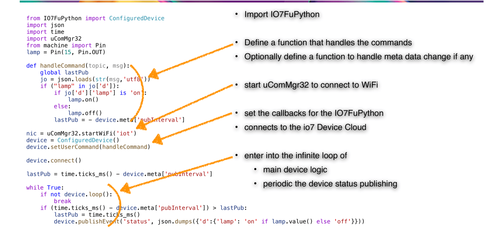

Application code goes in `device.py`, and `main.py` contains just `import device` — that
split is what lets the platform replace your code over the air later.

### The lamp

Relay IN on GPIO 15.

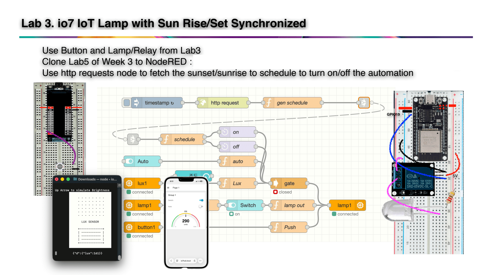

```python
from IO7FuPython import ConfiguredDevice
from machine import Pin
import uComMgr32, json, time

lamp = Pin(15, Pin.OUT)

def handleCommand(topic, msg):
    global lastPub
    jo = json.loads(str(msg, 'utf8'))
    if "lamp" in jo['d']:
        if jo['d']['lamp'] == 'on':
            lamp.on()
        elif jo['d']['lamp'] == 'off':
            lamp.off()
        elif jo['d']['lamp'] == 'toggle':
            lamp.value(not lamp.value())
        lastPub = -device.meta['pubInterval']

nic = uComMgr32.startWiFi('io7lamp')
device = ConfiguredDevice()
device.setUserCommand(handleCommand)
device.connect()

lastPub = -device.meta['pubInterval']
while True:
    if not device.loop():
        break
    if (time.ticks_ms() - device.meta['pubInterval']) > lastPub:
        lastPub = time.ticks_ms()
        device.publishEvent('status',
            json.dumps({'d': {'lamp': 'on' if lamp.value() else 'off'}}))
```

The device reports its **actual** pin state, not the command it received. That is why the
dashboard stays honest.

### The switch

Push button on GPIO 15 with an internal pull-up, on the second board.

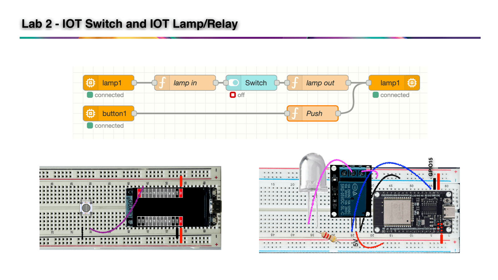

It publishes only when pressed:

```python
device.publishEvent('status', json.dumps({'d': {'button': 'pushed'}}))
```

### Try it

Kill the two dummy terminals and power up the boards. The dashboard, the light automation and
the gate all keep working, untouched. That is the point of the contract.


### What you just did

You pulled the dummies out and put hardware in, and nothing above the broker noticed.

Look back at what you did *not* touch: the flow, the dashboard, the gate, the light
automation, the platform. You changed the two things that were genuinely device-specific — a
pin number and a config file — and stopped there.

That is the payoff of the topic contract, and it is the reason the next step can swap the
language too.

---

## 6 · Swap in real devices (Arduino C++)

Same two devices again, this time in C++ with the **IO7F32** framework. Use this path if your
team is more comfortable in Arduino, or run it alongside Step 5 to compare.

You need VSCode with the PlatformIO extension.

| Repo | Device | Wiring |
|---|---|---|
| [`12.io7Lamp`](https://github.com/io7lab-lab/12.io7Lamp) | relay | IN on GPIO 15 |
| [`12.io7Switch`](https://github.com/io7lab-lab/12.io7Switch) | push button | GPIO 43 |

Clone, build, upload. Both sketches are the framework skeleton with just two functions
filled in — `publishData()` and `handleUserCommand()`.

### Configure over Wi-Fi, not over USB

IO7F32 boards have no config files. On first boot the board becomes a Wi-Fi access point and
serves a setup page.

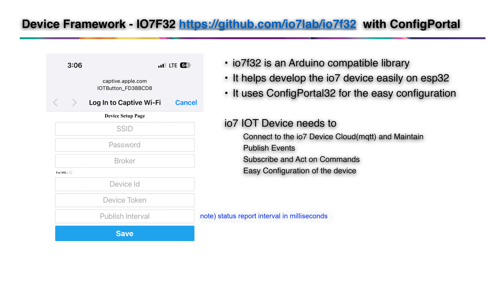

Connect a phone to that AP, enter your Wi-Fi credentials, the broker address, the device ID
and the token. Leave `pubInterval` empty — with 0, the switch publishes only when its state
changes.

### One line to change in the flow

`12.io7Switch` reports the button as a **level**, not an edge:

```json
{"d": {"switch": "on"}}     // pressed
{"d": {"switch": "off"}}    // released
```

The `Push` function from Step 4 is waiting for `{"d":{"button":"pushed"}}`, so change its
first line:

```javascript
if (msg.payload.d.switch !== 'on') {
    return null;
}
```

Filtering on `on` means one toggle per press; the release is ignored.

This one line is worth pausing on. **The framework fixes the topics, but the vocabulary
inside the payload is chosen by whoever wrote the device.** Event and command field names are
the real contract between a device and an application.

The lamp needs no change at all — `12.io7Lamp` already speaks `lamp` / `on` / `off` /
`toggle`.


### What you just did

You changed the language the devices are written in, and the system carried on.

But you also hit the limit of what the contract guarantees. The topics matched, so the
messages arrived — and then the flow ignored them, because this switch says `switch: "on"`
where the last one said `button: "pushed"`.

**The framework fixes the topics. The words inside the payload are chosen by whoever wrote
the device.** Those field names are the real agreement between a device and an application,
and they are what to write down first when two people build the two halves.

---

## 7 · Move the rule to an Edge Server

Everything so far decides in the cloud. Cut the internet and the switch stops working.

Step 7 fixes that for the one rule that must never fail, while keeping the dashboard where
you can reach it from anywhere.

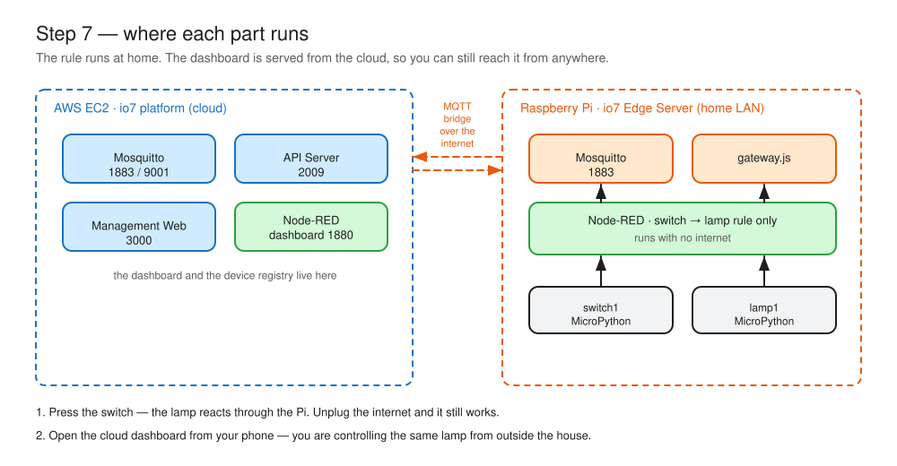

### Install the edge server

On a Raspberry Pi (4 or newer, 32 GB card):

```bash
git clone https://github.com/io7lab/io7-platform-edge.git
bash io7-platform-edge/setup/setup_docker_nodejs.sh
exit
```

Log back in, then:

```bash
bash io7-platform-edge/setup/io7-edge-setup.sh
```

You now have a second Mosquitto and a second Node-RED running at home, plus `gateway.js`
bridging them to the cloud.

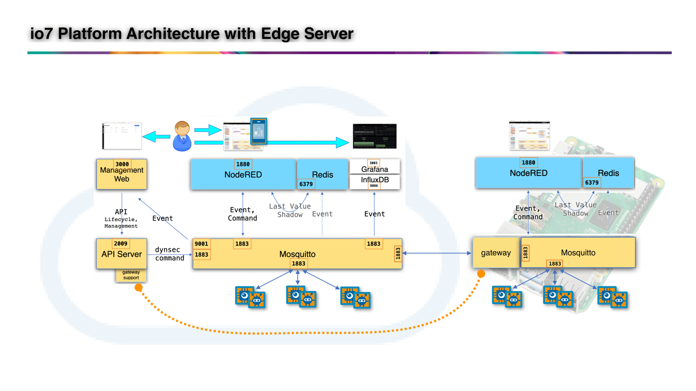

### Register the gateway

In Management Web, register the Pi as a device whose **type is `gateway`**. Give the gateway
that ID and token. On boot it announces itself, asks the cloud for its device list, and
registers any device that appears on its local broker — so the devices behind it show up in
the cloud registry without you entering them one by one.

### Point the devices at the Pi

Change `device.cfg` on both ESP32 boards so `broker` is the Pi's address instead of the
cloud's. Nothing else changes.

### Split the logic

| Runs on the Pi | Stays in the cloud |
|---|---|
| switch → lamp (the direct rule) | the dashboard |
| | the light-sensor automation and the gate |
| | history, charts, device registry |

Keep the Pi's Node-RED flow to exactly one thing: io7 in(`button1`) → `Push` → io7 out(`lamp1`).

### Prove it

1. Press the switch — the lamp responds through the Pi.
2. **Unplug the Pi's internet.** Press again. It still works.
3. Open the cloud dashboard on your phone over mobile data. You are controlling a lamp inside
   the house from outside it, through the bridge.

That is the trade in one experiment: local for reliability, cloud for reach.


### What you just did

You unplugged the internet and the lamp still worked.

That is the whole argument for edge computing, and you now have it as an experiment rather
than a slogan. Deciding in the cloud gave you reach, a dashboard, history and one place to
change policy. Deciding at home gave you a rule that survives an outage.

You did not have to choose between them. **The rule that must never fail runs locally; the
rest stays in the cloud** — and the gateway keeps both views in sync.

---

## 8 · Rebuild it in Python with io7app

Node-RED is not the only way to write the application. **io7app** is a small Python framework
that subscribes and publishes with decorators, which suits anyone who would rather diff code
than compare screenshots of flows.

### Install

```bash
mkdir io7app-lab && cd io7app-lab
uv venv
uv pip install io7app
```

Issue a second App ID (`app2`) in Management Web — **do not reuse `app1`.** The app ID is the
MQTT client ID, so two programs sharing one will disconnect each other in a loop.

Create `.env`:

```text
IO7_SERVER=my.example.com
IO7_APP_ID=app2
IO7_TOKEN=<YOUR_APP_TOKEN>
# IO7_LOG=DEBUG
```

### The same automation, nine lines

```python
"""Switch -> Lamp mirror."""
from io7app import App

app = App()


@app.on_event("button1", "status")
def on_switch(data):
    app.send_cmd("lamp1", "lamp", {"lamp": "toggle"})


if __name__ == "__main__":
    app.run()
```

```bash
uv run python switch_lamp.py
```

`io7 connected as app2` means you are in. Press the switch — the lamp toggles, with no flow
anywhere in sight.

Add the light automation the same way, with a second handler on `lux1` and a module-level
flag standing in for the gate.

### A web page, vibe-coded

io7app is plain Python, so a web UI is just a web framework on top of it. Describe what you
want to a coding assistant, point it at your handlers, and let it write the page.

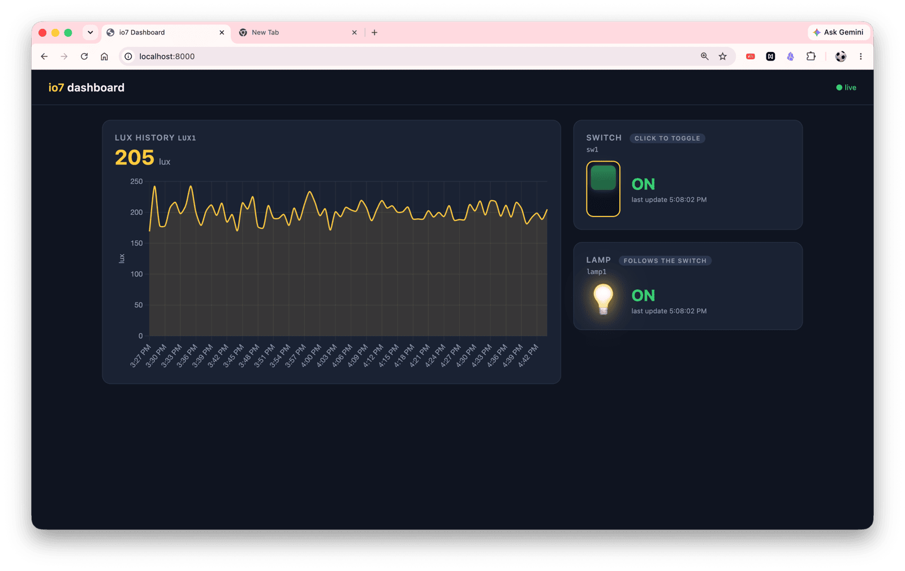


The device state your handlers already track is the model; the page is a view of it. Ask for
a lamp toggle, a light gauge, and an auto on/off switch, and you have rebuilt the Step 4
dashboard in code you own.


### What you just did

You wrote the Step 4 automation a second time, in nine lines of Python, and it behaved
identically.

Which tells you something about the platform: **the application layer is replaceable too.**
Node-RED is a way to write an io7 application, not a requirement of one. Anything that can
speak MQTT with an App ID can be the brain — a Python script, a web service, a coding
assistant's output.

Choose by what you need. Flows are quicker to see and to demonstrate; code is quicker to
diff, test and deploy.

---

## What you learned

You followed eight steps and built one small system. Along the way you picked up the ideas
that carry over to any IoT work, whether or not you keep using io7.

**A device is a contract, not a thing.** `iot3/<deviceId>/evt/...` to report,
`iot3/<deviceId>/cmd/...` to be commanded, `{"d": {...}}` inside. Anything that honours that is
a device — a Node.js dummy, a MicroPython board, a C++ sketch. That is why you swapped the
hardware twice and changed the language once without rewriting the application.

**Automation is three moves.** Something reports, the application decides, something is
commanded. Every flow you built was a variation on it, and nothing in the middle needed to
know what was on either end.

**Keep the decision out of the device.** You never reflashed a board to change a policy. The
lamp did not know about the switch; the switch did not know about the light sensor. Changing
what the system *does* meant editing a flow, not a firmware.

**Report reality, not intention.** The devices published the state of their own pins, not the
command they received. That single habit is why the dashboard stayed correct no matter who
pressed what.

**The field names are the real agreement.** The topics are fixed by the framework; the words
inside the payload are not. `button: "pushed"` and `switch: "on"` cost you a line of code in
Step 6, and that is the cheap version of a problem that gets expensive between teams.

**Decide where to decide.** Cloud gives you reach, history and one place to change policy;
local gives you a rule that survives an outage. Step 7 let you have both, and the choice is
per rule, not per system.

**Both halves are replaceable.** The device layer swapped three ways, and in Step 8 the
application layer swapped too. What stayed fixed the whole time was the broker and the topic
convention. Everything else was yours to choose.

---

## Reference

### Ports

| Port | Service |
|---|---|
| 1883 | MQTT |
| 9001 | MQTT over WebSocket (browsers) |
| 1880 | Node-RED and the dashboard |
| 2009 | io7 API Server |
| 3000 | Management Web |
| 3003 | Grafana |
| 8086 | InfluxDB |
| 6379 | Redis (internal) |

### Dummy device modes

```bash
npx github:io7lab/io7dummy-device <mode>
```

`lamp` · `switch` · `button` · `lux` · `rotary` · `thermo` · `thermostat` · `valve` ·
`twoButtons`

Settings are saved as `<mode>.cfg` in the working directory.

### Repositories

| Repo | Contents |
|---|---|
| [io7-platform-cloud](https://github.com/io7lab/io7-platform-cloud) | The cloud platform and its install scripts |
| [io7-platform-edge](https://github.com/io7lab/io7-platform-edge) | The edge server |
| [IO7FuPython](https://github.com/io7lab/IO7FuPython) | MicroPython device framework |
| [IO7F32](https://github.com/io7lab/IO7F32) | Arduino C++ device framework (ESP32) |
| [io7app](https://github.com/io7lab/io7app) | Python application framework |
| [io7dummy-device](https://github.com/io7lab/io7dummy-device) | Simulated devices |
| [node-red-contrib-io7](https://github.com/io7lab/node-red-contrib-io7) | The io7 in / io7 out nodes |

Lab flows and device code for each step are under
[github.com/io7lab-lab](https://github.com/io7lab-lab).

### Troubleshooting

| Symptom | Look at |
|---|---|
| Management Web loads, login does nothing | Port 2009 blocked |
| Device is running but shows offline | Port 9001 blocked |
| io7 node shows `disconnected` | App ID / token wrong, or Host is not `mqtt` |
| Device refuses to connect | Device ID or token differs from the registry; port 1883 closed |
| Dashboard switch flickers | Pass-through is still enabled on the widget |
| Two apps keep dropping | They share one App ID — issue a second one |
| A subscribe returns nothing, no error | Typo in the topic. Brokers accept any subscription, valid or not |

### Diagrams

The two diagrams in this guide are editable. Open the `.excalidraw` files in
[excalidraw.com](https://excalidraw.com) and re-export the SVG next to them.

```text
diagrams/learning-path.excalidraw   diagrams/learning-path.svg
diagrams/edge-topology.excalidraw   diagrams/edge-topology.svg
```
