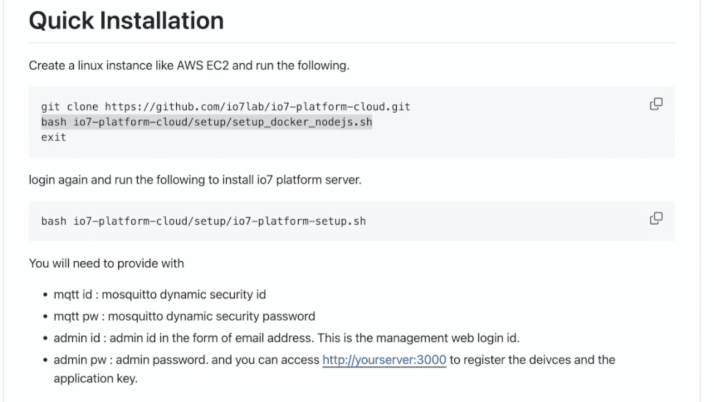
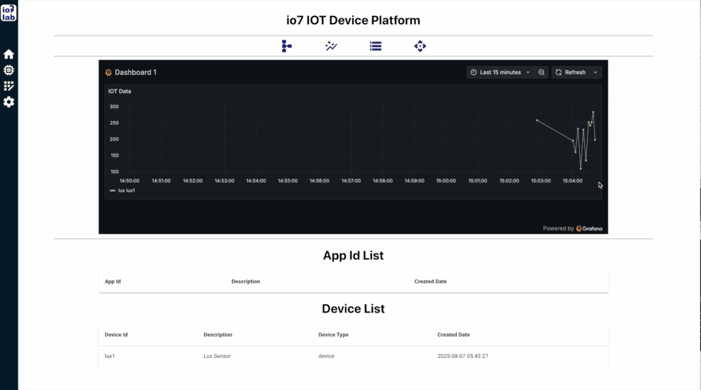
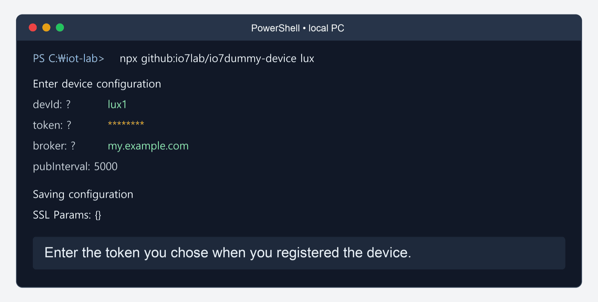
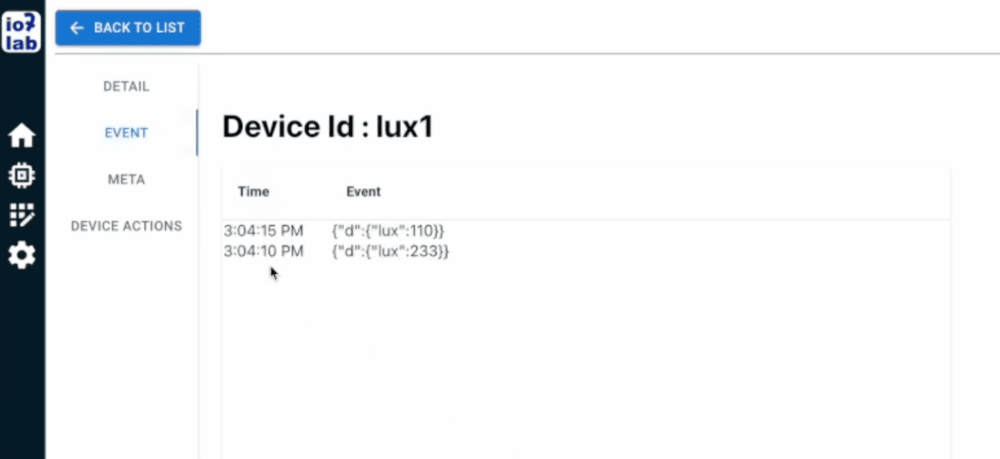
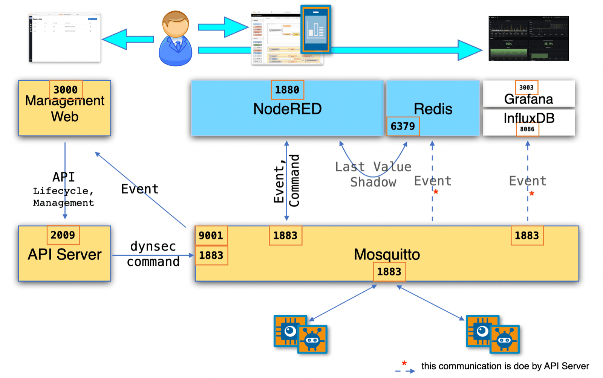

# io7 Platform — User Guide

**io7 is a ready-made IoT platform.** The MQTT broker, the device registry, Node-RED, the
dashboard, the time-series store and the charts are already built and packaged as containers.
You do not assemble any of that. Two scripts put it on a Linux server, and from then on your
time goes into the part that is actually yours — your devices and your automations.

This guide is about that second part. Get the platform running first — it is two scripts and
a dummy device, and you can do it in an afternoon without buying anything. The lessons start
after that.

By the end you have a lamp that a switch turns on, a light sensor that turns it on by itself,
and a dashboard you can open from your phone. If you want to go further, the same automation
can run on a Raspberry Pi at home, or be written in Python instead of Node-RED.

---

## The path

**Get it running** — no hardware, no commitment.

| Step | What you do |
|---|---|
| [1](#1--install-the-platform) | Install the platform on Linux or AWS EC2 |
| [2](#2--verify-with-a-dummy-device) | Watch a simulated device report to it |
| [3](#3--how-it-fits-together) | Now that you have seen it work, see what the parts are |

**The lessons** — build something real.

| Step | What you do | Hardware needed |
|---|---|---|
| [4](#4--build-the-automation-in-node-red) | Write your automation: lamp → switch → light sensor → gate → dashboard | none |
| [5](#5--swap-in-real-devices-micropython) | Put real MicroPython devices under it | 2 × ESP32, relay, button |
| [6](#6--swap-in-real-devices-arduino-c) | Or Arduino C++ devices instead | same boards |
| [7](#7--move-the-rule-to-an-edge-server) | Move a rule to a Raspberry Pi so it survives an outage | + Raspberry Pi |
| [8](#8--rebuild-it-in-python-with-io7app) | Write the same automation in Python, then vibe-code a web page | none |

Steps 1–4 need no hardware at all. If you only have an afternoon, do those — you will have a
working automation with simulated devices, and Steps 5 and 6 are then only about replacing
them.

---

## 1 · Install the platform

Any Linux box with Docker will do. These instructions use AWS EC2 because that is what most
people reach for, but a home server or a VM works the same.

### Prepare the machine

| Item | Recommended |
|---|---|
| OS | Ubuntu 22.04 or 24.04 |
| Instance | t3.small or larger (t3.micro works but leaves little headroom) |
| Storage | 20 GB (the 8 GB default fills up once events start accumulating) |

Open these inbound ports in your firewall or EC2 Security Group:

```text
22    SSH
1883  MQTT            9001  MQTT over WebSocket
3000  Management Web  2009  API Server
1880  Node-RED        3003  Grafana        8086  InfluxDB
```

### Install



Two scripts, in order. SSH into the machine and run:

```bash
git clone https://github.com/io7lab/io7-platform-cloud.git
bash io7-platform-cloud/setup/setup_docker_nodejs.sh
exit
```

The first script sets the hostname and installs Node.js and Docker. **The `exit` matters** —
it adds you to the `docker` group, which only takes effect on the next login.

Log back in and check that both tools answer:

```bash
docker --version
node --version
```

Now install the platform itself:

```bash
bash io7-platform-cloud/setup/io7-platform-setup.sh
```

It asks four things. Write them down.

| Prompt | Meaning |
|---|---|
| mqtt id / pw | Mosquitto Dynamic Security admin account, used internally by the platform |
| admin id | An email-shaped ID — this is your Management Web login |
| admin pw | At least 8 characters, or the script stops |

> **Run this in a real terminal.** The script uses `docker exec -it` partway through. In a
> non-interactive shell that step fails silently, the install looks successful, and devices
> are rejected later for reasons that are very hard to trace.

### Check it

```bash
docker ps
```

Seven containers should be `Up`: `mqtt`, `nodered`, `redis`, `influxdb`, `io7api`, `io7web`,
`grafana`.

Then open `http://<your-host>:3000` and log in with the admin account.



> **If the page loads but the login button does nothing, port 2009 is blocked.** The browser
> loads the page from 3000 but talks to the API server on 2009 and to MQTT on 9001. Each
> blocked port fails in its own quiet way: 3000 → nothing loads, 2009 → login does nothing,
> 9001 → devices never show as online.

Your platform state lives in `~/data` and the compose file is `~/docker-compose.yml`. Those
two are the only things worth backing up; the containers are disposable.

---

## 2 · Verify with a dummy device

Before wiring anything, prove the whole path works. A dummy device is a terminal program
that behaves exactly like real hardware — same topics, same payloads, same registration.

**Register it.** In Management Web → Device List, add a device with ID `lux1` and a token of
your choosing (`lux1` is fine while learning). Type must be `device`.

**Run it.** On your laptop or on the server — anywhere with Node.js:

```bash
npx github:io7lab/io7dummy-device lux
```



```text
devId: ? lux1
token: ? lux1
broker: ? my.example.com
pubInterval: 5000
```

Answers are saved to `lux.cfg` in the current directory, named after the mode you ran.

A light sensor drawn in ASCII appears and starts publishing every 5 seconds. **Press the up
and down arrow keys** to fake bright and dark — roughly 900 and 200 lux.

**Watch it arrive.** Back in Management Web, `lux1` is now online, and its detail page shows
events streaming in.



If the values on screen change within a second or two of pressing an arrow key, every layer
is working: device → broker → API server → browser.

The platform also kept the last value it saw — the Device Shadow, which the next section
puts in context:

```bash
docker exec -it redis redis-cli GET lux1
```

---

## 3 · How it fits together

You just watched a value travel from a program on your laptop to a web page in your browser.
Here is what it passed through.

io7 is a small set of open-source services wired together by one MQTT broker. They arrive as
containers and you never edit them — but knowing which is which makes the lessons ahead, and
any troubleshooting, much easier.



Everything a device does is MQTT publish and subscribe. Everything an application does is
the same. The broker sits in the middle and nobody talks to anybody directly.

| Service | Port | What it does |
|---|---|---|
| Mosquitto | 1883 · 9001 | MQTT broker. 1883 for devices and apps, 9001 for browsers (WebSocket) |
| io7 API Server | 2009 | Device registry and lifecycle. Creates broker credentials when you register a device |
| Management Web | 3000 | Where you register devices, issue app IDs, and watch events arrive |
| Node-RED | 1880 | Where your automation lives, and where the dashboard is served |
| Redis | 6379 | Device Shadow — the last value each device reported |
| InfluxDB | 8086 | Time series history |
| Grafana | 3003 | Charts over that history |

### The contract

A device is anything that follows this topic convention. That is the whole definition — the
platform never asks what language it was written in or what board it runs on.

```text
iot3/<deviceId>/evt/<eventId>/fmt/json     device → platform   (events)
iot3/<deviceId>/cmd/<cmdId>/fmt/json       platform → device   (commands)
```

The payload is always JSON wrapped in a `d` object:

```json
{"d": {"lamp": "on"}}
```

That one rule is why Step 5 and Step 6 can replace the devices from Step 2 without touching
a single node in your flow.

### Two kinds of credentials

| Credential | Held by | Can do |
|---|---|---|
| **Device ID + token** | one device | publish and subscribe on its own `iot3/<deviceId>/…` topics only |
| **App ID + token** | an application (Node-RED, io7app) | subscribe to device events and publish commands |

A device cannot impersonate another device — the broker's access control is generated from
the registry when you register it.

---

## 4 · Build the automation in Node-RED

This is the heart of the guide. You build one flow in four passes, each pass adding a
capability. Open Node-RED at `http://<your-host>:1880`.

First, get an App ID: Management Web → App Id List → add `app1` and note its token. Node-RED
uses this to talk to the broker.

### Set up the io7 nodes

**The io7 nodes are already there.** You did not install them by hand because the platform
installer did it for you — `io7-platform-setup.sh` ends by running `npm i` in `~/data/nodered`,
and the `package.json` shipped in that directory lists `node-red-contrib-io7` as a dependency:

```json
"dependencies": {
    "io7-nodered-auth": "github:io7lab/io7-nodered-auth",
    "node-red-contrib-io7": "github:io7lab/node-red-contrib-io7",
    "redis": "^4.6.13"
}
```

Since `~/data/nodered` is mounted into the Node-RED container, the nodes appear in the palette
the moment the container starts.

You get three of them. **io7 in** subscribes to a device's events, **io7 out** publishes a
command, and **io7-hub** holds the connection settings both share. Pick a device ID and an
event name; the nodes assemble the topic and parse the JSON for you.

You could do the same with the generic `mqtt in` / `mqtt out` nodes, but then you type
`iot3/lux1/evt/status/fmt/json` by hand in every flow — and a single wrong character produces
no error at all, just silence. That failure mode costs more debugging time than anything else
in this guide.

> **Running Node-RED on your own?** A plain Node-RED install has none of this. Add the nodes
> from Manage palette → Install by searching `node-red-contrib-io7`, and set the io7-hub
> **Host** to your platform's hostname instead of `mqtt` — your Node-RED is outside the
> platform's Docker network, so the service name will not resolve.


| Field | Value |
|---|---|
| API Key / API Token | `app1` and its token |
| Host | `mqtt` |
| Port | 1883 |

> **Host is `mqtt`, not your domain name.** The bundled Node-RED runs in the same Docker
> network as the broker, so it reaches it by service name. Use your real hostname only when
> you run Node-RED outside the platform.

### Pass 1 — turn the lamp on and off

Register a device `lamp1`, then run a dummy lamp in a new terminal:

```bash
npx github:io7lab/io7dummy-device lamp
```

Build this: **inject** (`on`) and **inject** (`off`) → **change** → **io7 out**.


The change node wraps the plain string into an io7 command. Set the rule to
`Set msg.payload`, switch the value type to **expression (JSONata)**, and enter:

```text
{"d":{"lamp": msg.payload }}
```

Configure io7 out with Device Id `lamp1`, command `power`, format `json`.

Deploy. `connected` should appear under the node. Click the inject buttons — the ASCII lamp
in the terminal turns on and off.

### Pass 2 — let a switch do it

Now a *device* drives the lamp instead of you. Register `button1` and run:

```bash
npx github:io7lab/io7dummy-device button
```

Add **io7 in** (`button1`, event `status`) → **function** named `Push` → the existing io7 out.


```javascript
if (msg.payload.d.button !== 'pushed') {
    return null;
}
msg.payload = { d: { lamp: 'toggle' } };
return msg;
```

Press the space bar in the button terminal. The lamp toggles.

That is the whole shape of IoT automation: **device event → application decides → device
command.** Everything after this is a variation on it.

### Pass 3 — a dashboard

Install `@flowfuse/node-red-dashboard` (Dashboard 2.0 — not the deprecated
`node-red-dashboard`).

Drop a **ui-switch** widget and build its Group → Page → Dashboard once. Then wire both
directions:

- **control:** ui-switch → function `lamp out` → io7 out(`lamp1`)
- **display:** io7 in(`lamp1`) → function `lamp in` → ui-switch

```javascript
// lamp out
msg.payload = { d: { lamp: msg.payload } };
return msg;
```

```javascript
// lamp in
msg.payload = msg.payload.d.lamp;
return msg;
```

> **Turn off "If msg arrives on input, pass through to output" on the switch widget.**
> Otherwise the display message loops back out as a command, which produces another event,
> which loops again. With pass-through off, the widget shows what the device actually
> reports — no matter who changed it.

Open `http://<your-host>:1880/dashboard`. Flip the widget; the lamp follows. Press space in
the button terminal; the *widget* follows.

### Pass 4 — automate on light, and add a gate

Register `lux1` (you already did in Step 2) and run the lux dummy. Add
**io7 in**(`lux1`) → **function** `Lux` → io7 out(`lamp1`):


```javascript
let cmd = { d: {} };
cmd.d.lamp = msg.payload.d.lux > 800 ? 'off' : 'on';
msg.payload = cmd;
return msg;
```

Arrow keys in the lux terminal now turn the lamp on and off by themselves.

But automation that cannot be switched off is a nuisance — turn the lamp on manually in
daylight and the next reading kills it. So add a **gate**.

Install `node-red-contrib-simple-gate`. Put the gate between the `Lux` function and io7 out.
Add a second ui-switch labelled `Auto` → function `auto` → the gate.


```javascript
// auto
msg.topic = 'control';
return msg;
```

Set the Auto widget's On Payload to the string `open` and Off Payload to `close`; those are
the words the gate understands. Its Control Topic is `control` and Default State is `open`.


Three things should now be true:

1. With **Auto on**, changing the light changes the lamp.
2. With **Auto off**, the light is ignored.
3. With **Auto off**, the dashboard switch and the button still work — the gate only sits on
   the automation path.

Reference flows: [`3.iot-lamp`](https://github.com/io7lab-lab/3.iot-lamp) ·
[`3.iot-lamp-switch`](https://github.com/io7lab-lab/3.iot-lamp-switch) ·
[`3.iot-lamp-switch-dashboard`](https://github.com/io7lab-lab/3.iot-lamp-switch-dashboard) ·
[`3.iot-lamp-switch-dashboard-lux-auto`](https://github.com/io7lab-lab/3.iot-lamp-switch-dashboard-lux-auto)

---

## 5 · Swap in real devices (MicroPython)

Now replace the dummy lamp and switch with two ESP32 boards. **Do not change the flow.**
Register the same device IDs, or reuse `lamp1` and `button1` directly.

This is the moment the topic contract pays off. The flow you wrote in Step 4, the dashboard
you opened on your phone, the gate you added — none of it knows or cares what is on the other
end of the broker.


You need: 2 × ESP32, one relay module, one push button, breadboard and jumpers.

### Install the framework

Flash MicroPython, open Thonny, connect Wi-Fi in the REPL, then:

```python
import mip
mip.install('github:io7lab/IO7FuPython/')
```

Two config files go on the board:

```json
// wifi.cfg
{"ssid": "<YOUR_SSID>", "pw": "<YOUR_PASSWORD>"}
```

```json
// device.cfg
{"broker": "my.example.com", "token": "lamp1", "devId": "lamp1"}
```


Application code goes in `device.py`, and `main.py` contains just `import device` — that
split is what lets the platform replace your code over the air later.

### The lamp

Relay IN on GPIO 15.


```python
from IO7FuPython import ConfiguredDevice
from machine import Pin
import uComMgr32, json, time

lamp = Pin(15, Pin.OUT)

def handleCommand(topic, msg):
    global lastPub
    jo = json.loads(str(msg, 'utf8'))
    if "lamp" in jo['d']:
        if jo['d']['lamp'] == 'on':
            lamp.on()
        elif jo['d']['lamp'] == 'off':
            lamp.off()
        elif jo['d']['lamp'] == 'toggle':
            lamp.value(not lamp.value())
        lastPub = -device.meta['pubInterval']

nic = uComMgr32.startWiFi('io7lamp')
device = ConfiguredDevice()
device.setUserCommand(handleCommand)
device.connect()

lastPub = -device.meta['pubInterval']
while True:
    if not device.loop():
        break
    if (time.ticks_ms() - device.meta['pubInterval']) > lastPub:
        lastPub = time.ticks_ms()
        device.publishEvent('status',
            json.dumps({'d': {'lamp': 'on' if lamp.value() else 'off'}}))
```

The device reports its **actual** pin state, not the command it received. That is why the
dashboard stays honest.

### The switch

Push button on GPIO 15 with an internal pull-up, on the second board.


It publishes only when pressed:

```python
device.publishEvent('status', json.dumps({'d': {'button': 'pushed'}}))
```

### Try it

Kill the two dummy terminals and power up the boards. The dashboard, the light automation and
the gate all keep working, untouched. That is the point of the contract.

---

## 6 · Swap in real devices (Arduino C++)

Same two devices again, this time in C++ with the **IO7F32** framework. Use this path if your
team is more comfortable in Arduino, or run it alongside Step 5 to compare.

You need VSCode with the PlatformIO extension.

| Repo | Device | Wiring |
|---|---|---|
| [`12.io7Lamp`](https://github.com/io7lab-lab/12.io7Lamp) | relay | IN on GPIO 15 |
| [`12.io7Switch`](https://github.com/io7lab-lab/12.io7Switch) | push button | GPIO 43 |

Clone, build, upload. Both sketches are the framework skeleton with just two functions
filled in — `publishData()` and `handleUserCommand()`.

### Configure over Wi-Fi, not over USB

IO7F32 boards have no config files. On first boot the board becomes a Wi-Fi access point and
serves a setup page.


Connect a phone to that AP, enter your Wi-Fi credentials, the broker address, the device ID
and the token. Leave `pubInterval` empty — with 0, the switch publishes only when its state
changes.

### One line to change in the flow

`12.io7Switch` reports the button as a **level**, not an edge:

```json
{"d": {"switch": "on"}}     // pressed
{"d": {"switch": "off"}}    // released
```

The `Push` function from Step 4 is waiting for `{"d":{"button":"pushed"}}`, so change its
first line:

```javascript
if (msg.payload.d.switch !== 'on') {
    return null;
}
```

Filtering on `on` means one toggle per press; the release is ignored.

This one line is worth pausing on. **The framework fixes the topics, but the vocabulary
inside the payload is chosen by whoever wrote the device.** Event and command field names are
the real contract between a device and an application.

The lamp needs no change at all — `12.io7Lamp` already speaks `lamp` / `on` / `off` /
`toggle`.

---

## 7 · Move the rule to an Edge Server

Everything so far decides in the cloud. Cut the internet and the switch stops working.

Step 7 fixes that for the one rule that must never fail, while keeping the dashboard where
you can reach it from anywhere.


### Install the edge server

On a Raspberry Pi (4 or newer, 32 GB card):

```bash
git clone https://github.com/io7lab/io7-platform-edge.git
bash io7-platform-edge/setup/setup_docker_nodejs.sh
exit
```

Log back in, then:

```bash
bash io7-platform-edge/setup/io7-edge-setup.sh
```

You now have a second Mosquitto and a second Node-RED running at home, plus `gateway.js`
bridging them to the cloud.


### Register the gateway

In Management Web, register the Pi as a device whose **type is `gateway`**. Give the gateway
that ID and token. On boot it announces itself, asks the cloud for its device list, and
registers any device that appears on its local broker — so the devices behind it show up in
the cloud registry without you entering them one by one.

### Point the devices at the Pi

Change `device.cfg` on both ESP32 boards so `broker` is the Pi's address instead of the
cloud's. Nothing else changes.

### Split the logic

| Runs on the Pi | Stays in the cloud |
|---|---|
| switch → lamp (the direct rule) | the dashboard |
| | the light-sensor automation and the gate |
| | history, charts, device registry |

Keep the Pi's Node-RED flow to exactly one thing: io7 in(`button1`) → `Push` → io7 out(`lamp1`).

### Prove it

1. Press the switch — the lamp responds through the Pi.
2. **Unplug the Pi's internet.** Press again. It still works.
3. Open the cloud dashboard on your phone over mobile data. You are controlling a lamp inside
   the house from outside it, through the bridge.

That is the trade in one experiment: local for reliability, cloud for reach.

---

## 8 · Rebuild it in Python with io7app

Node-RED is not the only way to write the application. **io7app** is a small Python framework
that subscribes and publishes with decorators, which suits anyone who would rather diff code
than compare screenshots of flows.

### Install

```bash
mkdir io7app-lab && cd io7app-lab
uv venv
uv pip install io7app
```

Issue a second App ID (`app2`) in Management Web — **do not reuse `app1`.** The app ID is the
MQTT client ID, so two programs sharing one will disconnect each other in a loop.

Create `.env`:

```text
IO7_SERVER=my.example.com
IO7_APP_ID=app2
IO7_TOKEN=<YOUR_APP_TOKEN>
# IO7_LOG=DEBUG
```

### The same automation, nine lines

```python
"""Switch -> Lamp mirror."""
from io7app import App

app = App()


@app.on_event("button1", "status")
def on_switch(data):
    app.send_cmd("lamp1", "lamp", {"lamp": "toggle"})


if __name__ == "__main__":
    app.run()
```

```bash
uv run python switch_lamp.py
```

`io7 connected as app2` means you are in. Press the switch — the lamp toggles, with no flow
anywhere in sight.

Add the light automation the same way, with a second handler on `lux1` and a module-level
flag standing in for the gate.

### A web page, vibe-coded

io7app is plain Python, so a web UI is just a web framework on top of it. Describe what you
want to a coding assistant, point it at your handlers, and let it write the page.


The device state your handlers already track is the model; the page is a view of it. Ask for
a lamp toggle, a light gauge, and an auto on/off switch, and you have rebuilt the Step 4
dashboard in code you own.

---

## Reference

### Ports

| Port | Service |
|---|---|
| 1883 | MQTT |
| 9001 | MQTT over WebSocket (browsers) |
| 1880 | Node-RED and the dashboard |
| 2009 | io7 API Server |
| 3000 | Management Web |
| 3003 | Grafana |
| 8086 | InfluxDB |
| 6379 | Redis (internal) |

### Dummy device modes

```bash
npx github:io7lab/io7dummy-device <mode>
```

`lamp` · `switch` · `button` · `lux` · `rotary` · `thermo` · `thermostat` · `valve` ·
`twoButtons`

Settings are saved as `<mode>.cfg` in the working directory.

### Repositories

| Repo | Contents |
|---|---|
| [io7-platform-cloud](https://github.com/io7lab/io7-platform-cloud) | The cloud platform and its install scripts |
| [io7-platform-edge](https://github.com/io7lab/io7-platform-edge) | The edge server |
| [IO7FuPython](https://github.com/io7lab/IO7FuPython) | MicroPython device framework |
| [IO7F32](https://github.com/io7lab/IO7F32) | Arduino C++ device framework (ESP32) |
| [io7app](https://github.com/io7lab/io7app) | Python application framework |
| [io7dummy-device](https://github.com/io7lab/io7dummy-device) | Simulated devices |
| [node-red-contrib-io7](https://github.com/io7lab/node-red-contrib-io7) | The io7 in / io7 out nodes |

Lab flows and device code for each step are under
[github.com/io7lab-lab](https://github.com/io7lab-lab).

### Troubleshooting

| Symptom | Look at |
|---|---|
| Management Web loads, login does nothing | Port 2009 blocked |
| Device is running but shows offline | Port 9001 blocked |
| io7 node shows `disconnected` | App ID / token wrong, or Host is not `mqtt` |
| Device refuses to connect | Device ID or token differs from the registry; port 1883 closed |
| Dashboard switch flickers | Pass-through is still enabled on the widget |
| Two apps keep dropping | They share one App ID — issue a second one |
| A subscribe returns nothing, no error | Typo in the topic. Brokers accept any subscription, valid or not |

### Diagrams

The two diagrams in this guide are editable. Open the `.excalidraw` files in
[excalidraw.com](https://excalidraw.com) and re-export the SVG next to them.

```text
diagrams/learning-path.excalidraw   diagrams/learning-path.svg
diagrams/edge-topology.excalidraw   diagrams/edge-topology.svg
```
